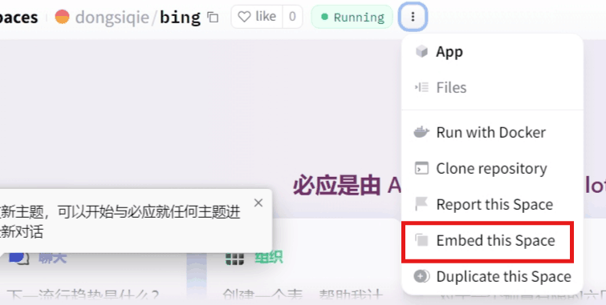
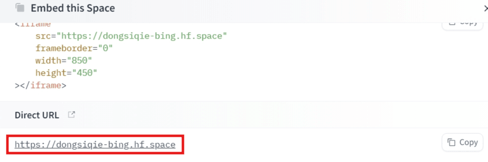

## 演示站点

如果不能免登陆了，需要设置一下cookie，随便填写一个`KievRPSSecAuth`的值才能免登陆使用

以下都是可以免登陆使用的

https://harry-zklcdc-go-proxy-bingai.hf.space

https://dongsiqie-bing.hf.space

https://dongsiqie-bingai.hf.space

https://bingai.zklcdc.xyz/

## 一键部署地址

如果你hugging face没有账号，请[参考文章注册一个](https://dongsiqie.me/huggingface-sign-up)

登陆hugging face后，可以使用下面的一键部署地址

hugging face一键部署地址1，[使用作者镜像](https://huggingface.co/spaces/Harry-zklcdc/go-proxy-bingai?duplicate=true&visibility=public)

hugging face一键部署地址2，[使用冻死企鹅镜像](https://huggingface.co/spaces/dongsiqie/bing?duplicate=true&visibility=public)

## 环境变量

需要两个必填的环境变量Space variables Public

`USER_KievRPSSecAuth`：随便填写一个字符串，也可以[点击生成一个uuid](https://guidgenerator.com/)填写进去，作用是免登陆

`HEADLESS`：固定值 false，huggingface部署必须传这个参数，否则无法自动过机器人验证

## 获取地址（`Public`专享）

点上面的三个点（更多），然后再点 `Embed this Space`





记下网址，大改长这样 https://dongsiqie-bing.hf.space

网址的规则是

```
https://你的名字-Space名称.hf.space
```

## 使用教程

部署完成以后，可以直接免登陆使用

如果需要画图或者使用插件，必须使用cookie登陆才可以，以下链接可以获取自己的cookie然后填写到`go-proxy-bingai`镜像中

[国内免魔法获取cookie](https://dongsiqie.me/wiki/bingcookie3.html)
