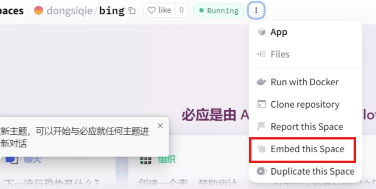
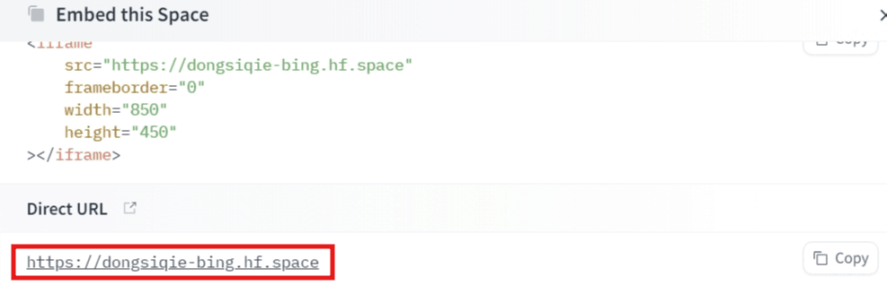

## Demonstration Sites

If you cannot bypass the login anymore, you need to set a cookie. Just fill in a value for `KievRPSSecAuth` to use without logging in.

The following can be used without logging in:

https://harry-zklcdc-go-proxy-bingai.hf.space

https://dongsiqie-bing.hf.space

https://dongsiqie-bingai.hf.space

https://bingai.zklcdc.xyz/

## One-click deployment address

If you do not have a hugging face account, please [refer to the article to register one](https://dongsiqie.me/huggingface-sign-up).

After logging in to Hugging Face, you can use the following one-click deployment address:

Hugging Face one-click deployment address 1, [using the author's image](https://huggingface.co/spaces/Harry-zklcdc/go-proxy-bingai?duplicate=true&visibility=public).

Hugging face one-click deployment address 2, [using the frozen penguin image](https://huggingface.co/spaces/dongsiqie/bing?duplicate=true&visibility=public).

## Environment Variables

Two mandatory environment variables Space variables Public are required.

`USER_KievRPSSecAuth`: arbitrarily fill in a string, or you can [click to generate a uuid](https://guidgenerator.com/) and fill it in. The function is to bypass the login.

`HEADLESS`: fixed value false. Hugging Face deployment must pass this parameter, otherwise it cannot automatically pass the robot verification.

## Get the address (For `Public`)

Click on the three dots above (more), and then click `Embed this Space`.





Take note of the URL, it usually looks like this https://dongsiqie-bing.hf.space

The rule of the URL is:

```
https://Your Name-Space Name.hf.space
```

## Tutorial

After deployment is complete, it can be used directly without logging in.

If you need to draw or use plugins, you must log in with a cookie. The following link can get your own cookie and then fill it in the `go-proxy-bingai` image.

[Get cookies](https://dongsiqie.me/wiki/bingcookie3.html)
